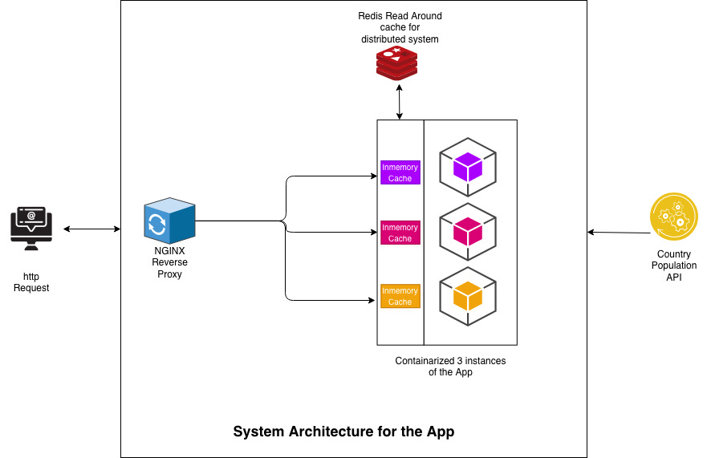

## Country Comparison API

### What is this?

The Country Comparison API will use data from a 3rd party provider, [api.population.io](http://api.population.io)<sup>[1](#footnote1)</sup>, to provide comparisons on population statistics.  Your colleague Joe Coder started the implementation (in Node.js v10 using restify), and now it's your turn to bring it to the next level.  

Our current stack is primarily built in Node.js, Golang, and .NET.  Since this service is just getting off the ground, if you'd rather implement this in a different language, feel free to do so.

### Setup

1. Download the repo
2. Run `npm install` to install dependencies
3. Run `npm test` to run unit tests
4. Set your NODE_ENV to `dev`
5. Run `npm start` to start the server

### Requirements

Joe created one endpoint that retrieves a list of country names, using mock data.

1. Update the endpoint to pull country data from http://api.population.io/1.0/countries.
2. The endpoint http://api.population.io/1.0/population/:country/:date returns the total population for a given country on a given date.  Design and implement an endpoint in our API that will allow a consumer to specify an arbitrary set of countries and an optional sort order, and receive back a list of countries and their population based on the current date.  If a sort order was specified, return the list sorted on population size, according to the consumer's requested sort order.

Try to be consistent with Joe's implementation in terms of:
* unit tests
* documentation
* error handling
* response codes
* validation
* etc.

Zip your solution, upload it somewhere, and send us a link to the zipped file.

### Bonus
1. Some scenarios to consider (leave your thoughts inline in your code or edit the README):
  * How efficient is your code?  What are some ways that you could improve performance?
>    - Country service is linear time
>    - Population service is linear for most of the operations its linear and nlog(n) for sorting.

  * Suppose we expect this API to be hit 1000s of times a second.  How can we handle the load?
>    - The docker-compose.yml contains set up for 3 nodeJS Nodes which will be load balanced by nginx reverse proxy. Please refer to Architecture section below. This can handle approximately 1024 request as of now, but can be configured as per our needs.
>    - If need arise we can increase the number of application nodes and we should be able to handle the load required. This could be easily achieved when we use kubernetes as our platform, which can auto scale based on the incoming load.

  * What if the 3rd party provider is not available?  How resilient is our API? 
>    - I have provided the 2 levels of cache implemenation which should have very less impact on the service availibility. 
>    - If the service is not available for more than 24hrs then we would not be able to give them any population results.
>    - However we can render the countries list from our cache until something really cahnges in the list. 

  * What if the requirement for the new endpoint was to also allow the consumer to compare populations for any given date.  How would you modify your implementation?
>    - As I understand the new requirement would be to compare populations for one particular day. Then there is not much change required. 
>    - Currently I am defaulting the date to today's date, So having an other method which will accept the custom date should be built and reuse the same logic I have for sorting today. 

  * What if we have a database of users and we wanted to make our API smarter by defaulting comparisons to always include the population of the current user's country.  How could we accomplish this?
>    - If we know the user and his country, the new service endpoint should call the provided population-helper function which returns the country population for that day, I believe that should satisfy the requirement needs.

  * What if we wanted to keep a tally of the most frequently requested countries and have this be available to consumers.  How could we accomplish this?
>    - This would need a distributed counter per country (as we have it scaled out on multiple nodes). We can apply the CRDT (Conflict-free replicated Datatype) pattern to our population service, which helps us create separate counters for each country, at the same time communicate per node counts to all its peers, this can get us the real time counts for the countries in deamand. 

2. Dockerize the API
>I have added below files for dockerizing it. 
>  - ./Dockerfile
>  - ./docker-compose.yml
>  - ./docker/ngnix/*
>  - ./docer/redis/*

These files will be used to build the required images when you run the command 
```
docker-compose up
```
<br>

If you wish to just build a docker container of the app, Please use below command
```
docker build . -t <tagname>:<version>
```
This will just build the container for NodeJs app in the repo. 
<br>
<i><a name="footnote1"><sup>1</sup></a> Joe says that api.population.io is down, so try https://dyicn1e62j3n1.cloudfront.net as the host instead.</i>
<br>

## Assumptions : 
- As this data is country data, which hardly changes, it makes sense to cache it and serve the request from cache. 
- The Population data changes daily, so we can cache once per day per country and use it for rest of the day.

## Architecture



### Core Components of the above architecture.
#### NGINX Reverse Proxy
The application has Nginx reverse proxy which is configured to take calls from the users on port 80. 
Then it redirects the request to one of the 3 instances of Nodejs app containers, which will respond to the request.

- NodeJS Application Layer
There instances of the application will be started when you do 
`
docker-compose up
`

#### Cache Layer
Two Levels of chache is been added, 
- Local Inmemory node-cache, which caches everything which the node responds to. This is available as long as the system is not restarted. 
Reason for this level of cache is to reduce the burden on Redis cluster which we are using as distributed cache. 
- Redis for full level of distributed caching, which acts as fall back layer for in memor cache, and the actuall api is the fall back for Redis. 

Having this kind of cache mechanism will increase the resilency and would reduce the calls to 3rd party servies significantly. 


#### Package & Files added
##### Package "service"
This package includes cacheservice and httpservice
- cacheservice has all the files required for Cache Layer describe above. 
  - 2 Classes 
    - Cache.js - which is the entry point to the cache service.
    - RedisCacheService.js - has all the required code for connecting to Redis instance when available. 

- httpservice has files required to make fetch calls to the external service. 
  - 2 methods fetchUrl (to fetch 1 url), fetchUrls(to fetch multiple urls at once).

##### Package 'controllers'
Added population package under controllers which includes all the necessary code for making the service API calls to get Population counts.
- population.controller.js - main file which has the validation check and calling population-helper.js getPopulationCount() method.
- index.js - Routing path defintion. 

##### Package 'lib'
Added population-helper.js class which has the logic to fetch population based on the contries list sent in the request.
It also sorts the output based on sort option specified.

#### Testing files
Added population-test.js for testing population service. 

#### What I could have done better or imporved. 
Some of the things I would definetly consider making it part of the application are, 
- Distributed logging
- Healthchecks to make sure all the available services are up or not, this way we would know when the services are down.
- An APM monitor (Newrelic, Datadog) which gives insights on how well the application is doing. 
- An Network tracing agent like zipkin which will make debugging much more easier.
- Security of the application adding https, and some level of authorization by adding a Gateway in front of the NGINX service.
  - Simple one would be users registring for this service will get a api key, and use this for calling service.
- Test cases for Cache services.